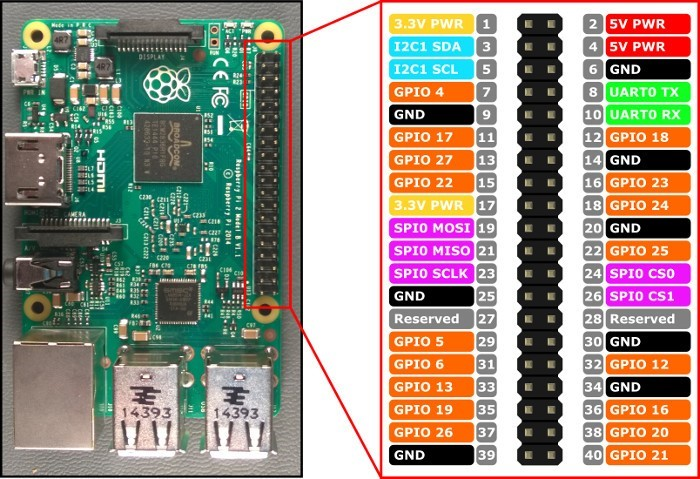
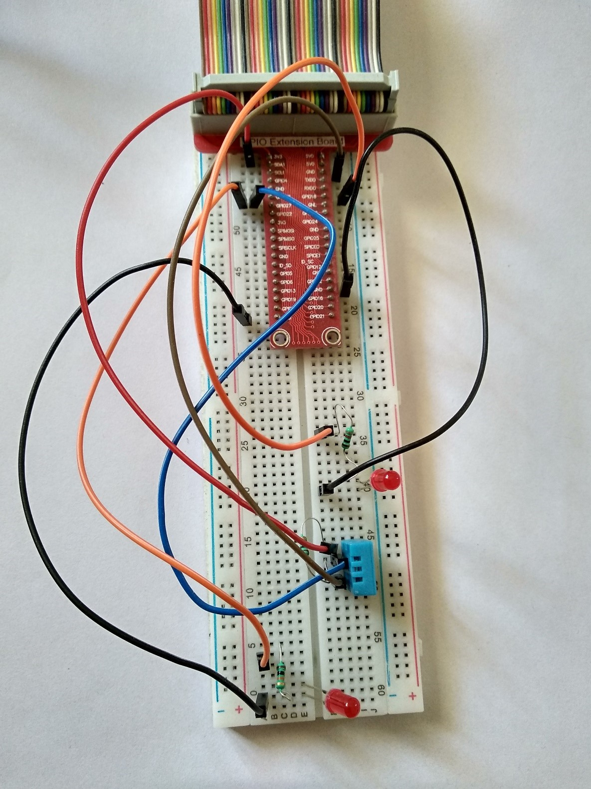
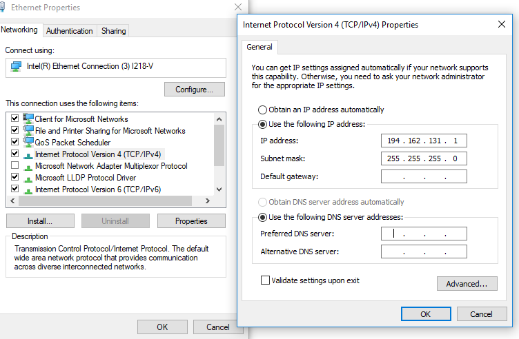
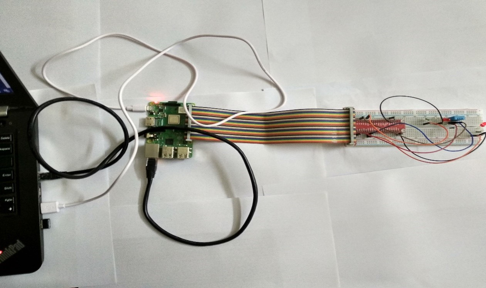
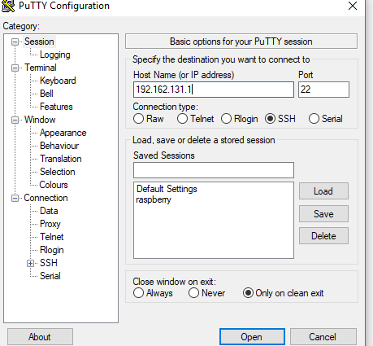
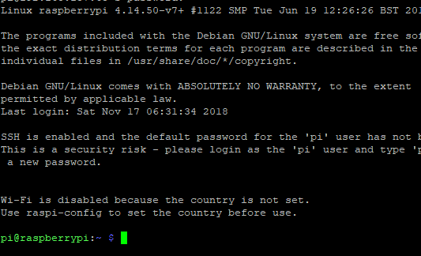
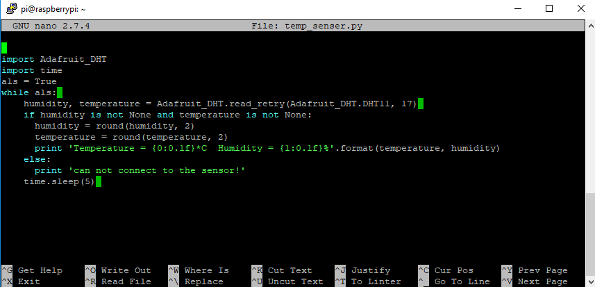
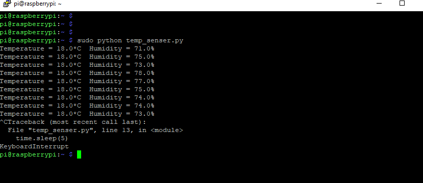
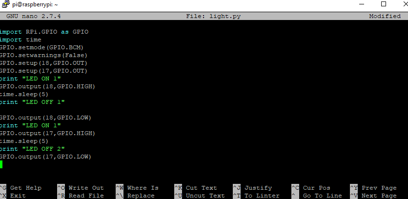
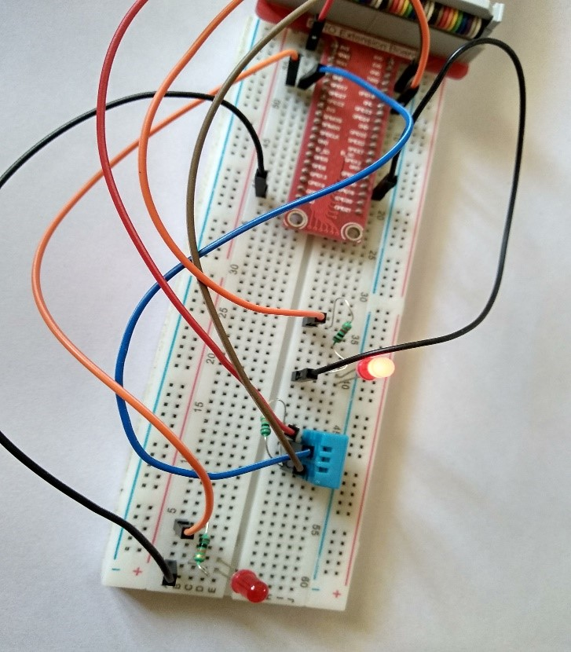

# project-IoT-raspberry-pi-
## Temperature detected by sensor.
- Aware of IoT/project   

>The block diagram of raspberry pi the interface of terminal. The code written in the terminal of the raspberry pi. The temperature sensor display the temp. On the terminal.

 

# GPIO PINS:
>The Raspberry Pi offers up its GPIO over a standard male header on the board. Over the years the header has expanded from 26 pins to 40 pins while maintaining the original pinout. If you're coming to the Raspberry Pi as an Arduino user, you're probably used to referencing pins with a single, unique number.

- Why is used GPIO?

>GPIO stands for General Purpose Input/Output. It's a standard interface used to connect microcontrollers to other electronic devices. For example, it can be used with sensors, diodes, displays, and System-on-Chip modules.

 ### Bread board, GPIO pins, jumper wires, DHT11 Temperature and Humidity, Sensor and Resistor LEDs:
 
 ### Connection raspberry pi though Laptop:
 >Connect your Ethernet cable to your computer and to the Raspberry Pi. Plug in the wall power adapter into the Raspberry Pi, and then plug it into the wall to turn the power on. Once the power is connected to the wall, the Raspberry Pi will be on.
 - Sharing Internet Over Ethernet:   
 >To share internet with multiple users over Ethernet, go to Network and Sharing Center. Then click on the WiFi network:

### What is PuTTY and what is it used for?
>Like OpenSSH, PuTTY is a very versatile tool for remote access to another computer. It's probably used more often by people who want secure remote shell access to a UNIX or Linux system than for any other purpose, though that is only one of its many uses. PuTTY is more than just an SSH client

### Terminal of raspberry pi  

### Project planning:
>1.	 I think the idea to sense the temperature and blink the LED though the codes.
2.	 Raspberry pi connect to pc and other instrument to support the temperature as well as LED blink.
3.	Plug the all the instrument and done the configuration.
4.	Install the software required to set up raspberry pi connection between computer.
5.	Than analysis the bugs.
6.	Than check the code working or not.

### Coding:

### output of temperature sensor

### LED blink coding

### LED blink 1

### LED blink 2

### Testing Techniques:
- check again GPIO pins
 

## raspberry by AWS mq 2 smoke sensor, pir motion sensor

# work in progress.............
