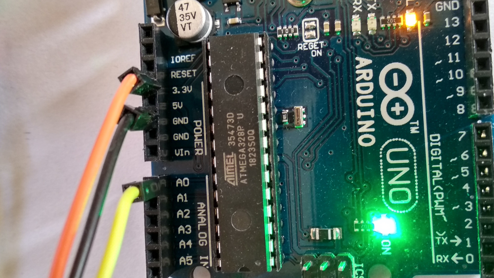
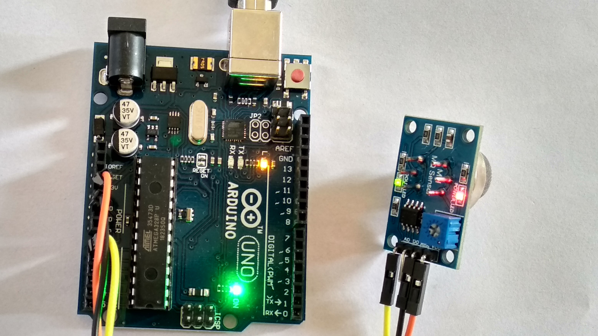
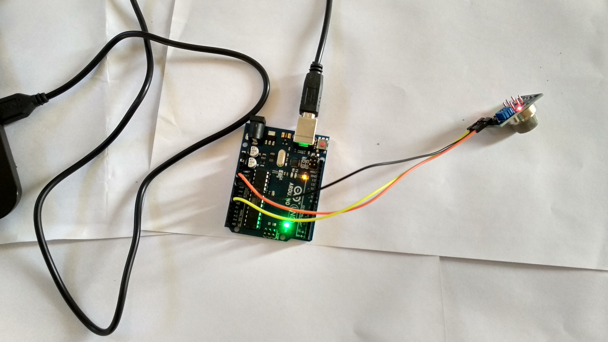
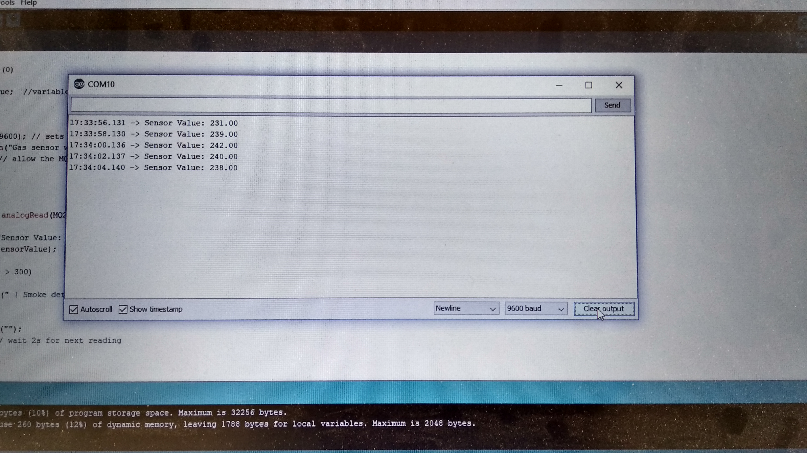
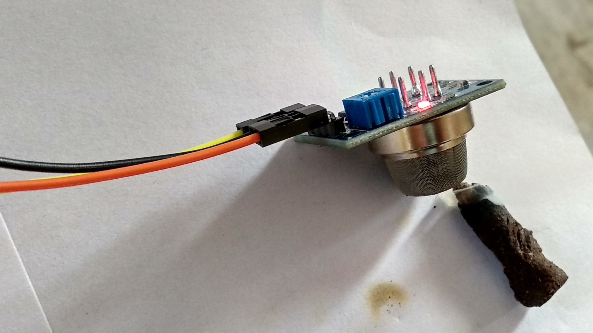
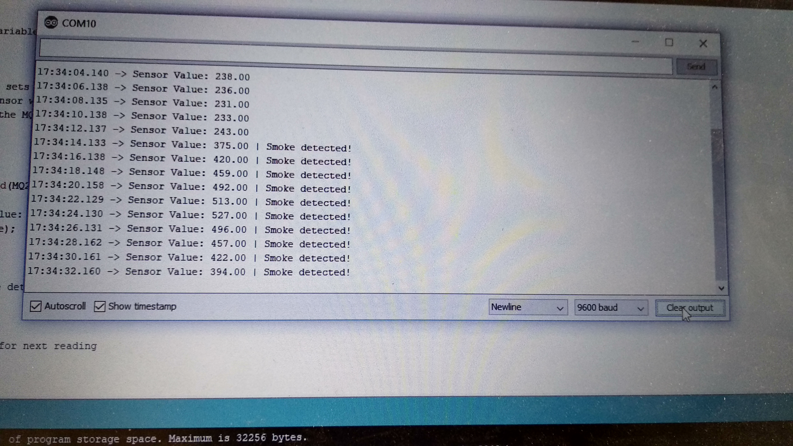

## What is MQ2 Gas Sensor?

>MQ2 is one of the commonly used gas sensors in MQ sensor series. It is a Metal Oxide Semiconductor (MOS) type Gas Sensor also known as Chemiresistors as the detection is based upon change of resistance of the sensing material when the Gas comes in contact with the material. Using a simple voltage divider network, concentrations of gas can be detected.

- MQ2 Gas Sensor

>MQ2 Gas sensor works on 5V DC and draws around 800mW. It can detect LPG, Smoke, Alcohol, Propane, Hydrogen, Methane and Carbon Monoxide concentrations anywhere from 200 to 10000ppm.

## Connection to Arduino

- MQ2 Sensor
- VCC- 3.3v
- GND- GND
- AO - AO

## Complete circuit

## Output

## Lets check Sensor MQ 2

## Output on Ardino Sketch

## .......................................................##
